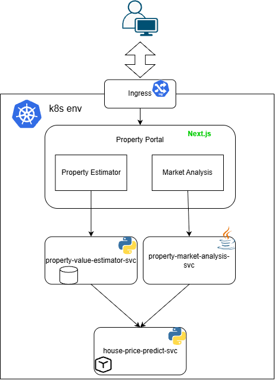

# Property Portal

A unified Next.js portal hosting two independent applications that interact with
the ML model from Task 1 (`house-price-predict-svc`):

| App | Route | Backend |
|-----|-------|---------|
| Property Value Estimator | `/estimator` | `property-value-estimator-svc` (Python / FastAPI) |
| Property Market Analysis | `/analysis` | `property-market-analysis-svc` (Java / Spring Boot) |

## Tech Stack

- **Next.js 16** (App Router) + **TypeScript**
- **Tailwind CSS v4** + **shadcn/ui** (Radix UI)
- **TanStack Query** for client-side data fetching
- **React Hook Form + Zod** for form state and validation
- **Recharts** for charts

## Architecture

The browser talks with property portal through k8s Ingress. All client-side requests go
through a **BFF proxy** implemented as Next.js route handlers:



This is required because the backends are ClusterIP services (unreachable from
the browser). The backend URLs live only in server-side environment variables.

Server Components that need initial data (e.g. `/analysis`) fetch the backend
directly from the server instead of going through the BFF proxy.
The portal itself runs as a ClusterIP service, exposed by the Ingress.

## Project Layout

```
app/
  layout.tsx                 root layout: sidebar + providers
  page.tsx                   redirects to /estimator
  loading.tsx / error.tsx    layout-level loading & error states
  estimator/                 App 1: form, history, compare
  analysis/                  App 2: dashboard, what-if
  api/estimator/[...path]/   BFF proxy -> Python backend
  api/analysis/[...path]/    BFF proxy -> Java backend
components/
  layout/                    sidebar
  estimator/                 form, result panel, sub-nav
  analysis/                  dashboard, filter bar, sub-nav
  ui/                        shadcn/ui components
lib/
  api/client.ts              type-safe fetch wrappers
  api/proxy.ts               BFF proxy helper
  hooks/use-property-filters.ts  shared filter state
  validators/estimator.ts    Zod schema (mirrors backend Pydantic)
types/index.ts               shared TS types
```

## Environment Variables

Server-side only (read by the BFF proxy and server components):

| Variable | Default | Purpose |
|----------|---------|---------|
| `ESTIMATOR_BACKEND_URL` | `http://property-value-estimator-svc` | Python backend |
| `ANALYSIS_BACKEND_URL` | `http://property-market-analysis-svc` | Java backend |

For local development, create `.env.local` and point these at reachable URLs
(e.g. `http://localhost:8000` after `kubectl port-forward`).

## Getting Started

```bash
npm install
npm run dev
```

Open [http://localhost:3000](http://localhost:3000).

## Build

```bash
npm run build
npm start
```

## Build & Deploy (k8s)

The portal is a frontend, so it is exposed via an **Ingress** (not ClusterIP),
routed by k8s's built-in Traefik controller.

### 1. Build the image

```bash
docker build -f Dockerfile -t interview/property-portal:latest .
```

### 2. Import into k3s' containerd

```bash
docker save interview/property-portal:latest -o property-portal.tar
sudo k3s ctr images import property-portal.tar
```

### 3. Configure the domain

The chart's Ingress uses the host `property-portal.local` (`charts/values.yaml`).
Add an entry to your hosts file so the browser can resolve it to the Traefik
node IP:

```
/etc/hosts
<node-ip>  property-portal.local
```


### 4. Deploy via Helm

```bash
helm install property-portal ./charts
```

### 5. Verify

```bash
kubectl get pods
kubectl get ingress property-portal
```

Then open http://property-portal.local in the browser.

### Override backend URLs

The backend service URLs are injected at runtime from the chart's values (not
baked into the image), so they can be overridden without rebuilding:

```bash
helm install property-portal ./charts \
  --set estimatorBackendUrl=http://property-value-estimator-svc \
  --set analysisBackendUrl=http://property-market-analysis-svc
```
